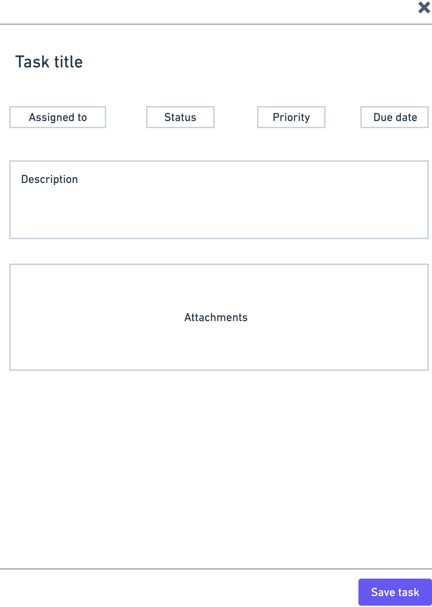
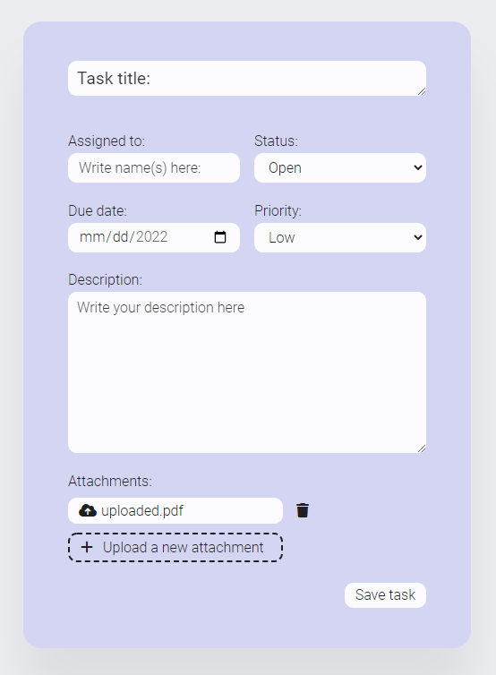

# User Interface Popup

This is my attempt at stylizing a given diagram into user friendly app popup.

## Table of contents

-  [Overview](#overview)
   -  [The challenge](#the-challenge)
   -  [Original image](#original-image)
   -  [Solution screenshot](#solution-screenshot)
   -  [Links](#links)
-  [My process](#my-process)
   -  [Built with](#built-with)
   -  [What I learned](#what-i-learned)
-  [Author](#author)

## Overview

### The challenge

Make a user interface that is good looking and user friendly. Make only the visualisation without any functionality.

Take into account all the contents of the diagram with the ability to change the composition of the elements.

In the "Attachments" part it is expected to:
-show all attacked files
-ability to remove an attached file
-ability to add more than one file

Use BEM methodology for class-naming.

### Original image

### Solution screenshot

### Links

-  Live Site URL: [https://majdrab.github.io/user-interface-popup/](https://majdrab.github.io/user-interface-popup/)

## My process

### Built with

-  HTML
-  CSS
-  [SASS](https://sass-lang.com/guide)

### What I learned

With this project I have used SASS(scss) for the first time and it was amazing. I've also been asked to use BEM naming methodology which I haven't used before.

## Author

-  Website - [Maj Drab](https://majdrab.github.io/)
